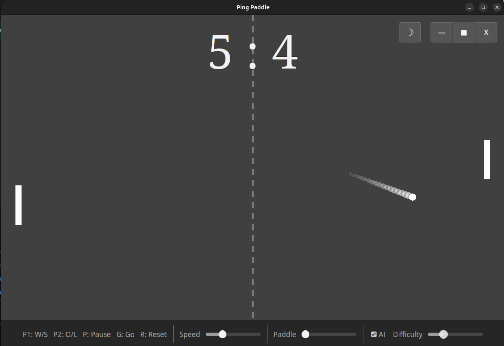

# Ping Paddle

A classic paddle-and-ball game inspired by Pong (1972), built with Godot 4.5 and GDScript.

Zero dependencies. Pure procedural rendering — no sprites, no textures. Procedural audio — no sound files. Everything is generated at runtime.



## Features

- **2-player local** (W/S vs O/L) or **vs AI** opponent
- **AI trajectory prediction** at higher difficulties — the AI doesn't just track, it predicts
- **Adjustable** ball speed, paddle size, and AI difficulty via bottom bar sliders
- **Dark/light theme** toggle with full UI theming
- **Window management** — fullscreen, windowed (1280x720), minimize
- **Ball trail** effect with fade and size falloff
- **Score flash** — brief screen pulse when a point is scored
- **Serve delay** — short pause between points for rhythm
- **Ball speed cap** — prevents tunneling on long rallies
- **Procedural sound effects** — retro sine wave beeps for paddle hits, wall bounces, and scoring
- **Modern typography** — serif/sans-serif font pairing (Noto Serif + Noto Sans)
- **Title screen** with pulsing call-to-action

## Controls

| Key | Action |
|-----|--------|
| W / S | Player 1 up / down |
| O / L | Player 2 up / down |
| P | Pause |
| G | Go (unpause) |
| R | Reset match |
| T | Toggle dark/light theme |
| Esc | Quit |

First to 7 wins. Use the bottom bar sliders to adjust speed, paddle size, and AI difficulty.

## Download & Play

Standalone builds (no Godot required):

- **Linux**: `build/linux/PingPaddle.x86_64` — make executable and run
- **Windows**: `build/windows/PingPaddle.exe` — double-click to play

Or grab the latest from [Releases](../../releases).

## Building from Source

Requires [Godot 4.5+](https://godotengine.org/download).

```bash
# Run directly
godot --path .

# Export standalone builds
godot --headless --export-release "Linux" build/linux/PingPaddle.x86_64
godot --headless --export-release "Windows" build/windows/PingPaddle.exe
```

## Architecture

Three scripts, two scenes, zero assets:

| File | Role |
|------|------|
| `scripts/Game.gd` | Game loop, ball physics, paddle input, AI, procedural rendering and audio |
| `scripts/Main.gd` | HUD, theme engine, window management, input routing, slider/button styling |
| `scripts/TitleScreen.gd` | Splash screen with dismiss logic |

Everything is rendered via `_draw()` — rectangles, circles, and lines. Sound effects are generated as sine waves with `AudioStreamWAV`. No files to load, no assets to manage.

## License

MIT — see [LICENSE](LICENSE) for details.

KeMeK Network © 2026
